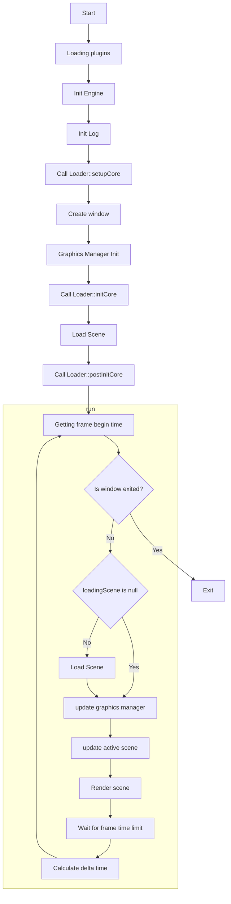

# Core

## 1. Working cycle

```mermaid
flowchart TB    
  A[Start] --> B[Loading plugins]
  B --> C[Init Engine]
  C --> D[Init Log]
  D --> E[Call Loader::setupCore]
  E --> F[Create window]
  F --> G[Graphics Manager Init]
  G --> H[Call Loader::initCore]
  H --> I[Load Scene]
  I --> J[Call Loader::postInitCore]
  J --> K
  subgraph run
    K[Getting frame begin time]
    K --> L{Is window exited?}
    N --> |No| M[Load Scene]
    N --> |Yes| O
    M --> O[update graphics manager]
    L -->|No| N{loadingScene is null}
    O --> P[update active scene]
    P --> R[Render scene] 
    R --> T[Wait for frame time limit]
    T --> U[Calculate delta time]
    U --> K 
     
  end
  L -->|Yes| S
  S[Exit]
```
