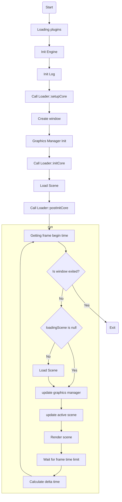

# Core

## 1. About

Core is basic class that manages all the processes in the game.

You can manage the core initialization via CoreLoader class.

## 2. Example

In main program call Core::runNew to run new Instance of Core and pass parameter CoreLoader

```c++
//main.cpp
#include <Rice/Engine/Core.hpp>
#include "CoreLoader.hpp"

int main(int argc, char *argv[]) {
  #ifdef WIN32
  #ifdef NDEBUG
  ShowWindow(GetConsoleWindow(), 0);
#endif
  SetProcessDPIAware();
    #endif
  Rice::Core::runNew(new_ptr<CoreLoader>());
  return 0;
}
```

In core loader you tell core what window to create and what scene to load

```c++
//CoreLoader.hpp
#pragma once
#include "Rice/Engine.hpp"

class CoreLoader : public Core::Loader {
  public:

    // setup core starts before creation of window 
    // and plugin initialization
    void setupCore(Core::SetupParams &params) override {
        params.window_desc = {"Game alpha(dev)", 1280, 720};
    }

    // init core called after
    // plugins and window is initialized
    void initCore(Core::InitParams &params) override { }

    // post init core after core initialization 
    // finished and before first core update
    void postInitCore(ptr<Engine> en) override {
        en->loadScene(
            std::static_pointer_cast<ClientScene>(TestScene::create()));
    }

    void onClose(ptr<Engine> en) override {}
};

```

## 3. Working cycle


