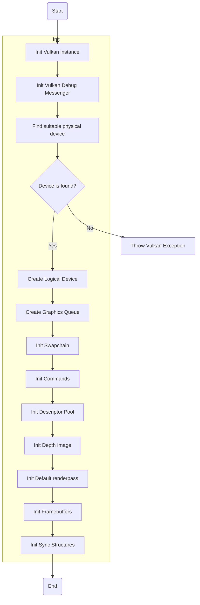
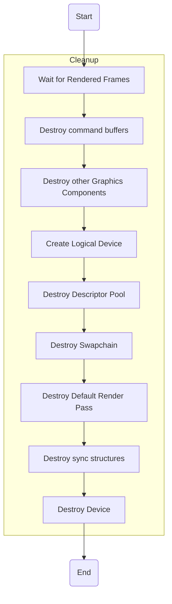

# Graphics Manager

## 1. About

Grapics Manager is class that manages all graphics objects in the Engine. It allocates them in defined order and destroys them in backwards order.

## 2. Graphics Manager Init (Vulkan toolchain)

## 3. Graphics Manager Cleanup (Vulkan toolchain)

