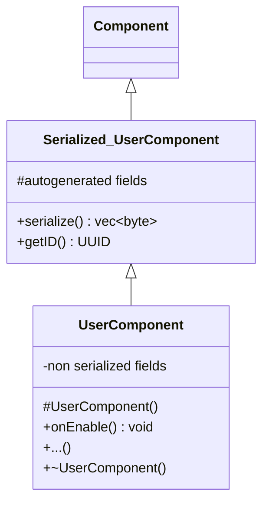

# Editor Library

## 1. Create Component GUI Editor

* ### Functions

  * Adding fields to the Component
  * Display field values and change it
    > Display int, float as input field but if user wants display as range slider (range defined in JSON)

* ### UML Diagram of user defined component

## 2. (opt) Create Scene Editor

* Displays scene as tree
* Allows user create objects and configure it's components
