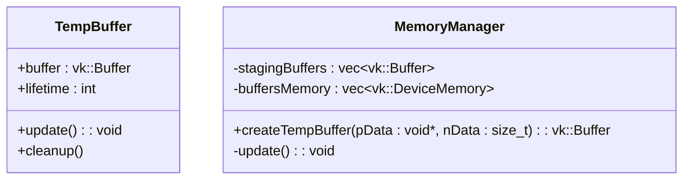

# Staging Buffer

Write it to replace direct copying from cpu to gpu while rendering.

## Memory manager

### About

sub-class of graphics manager

### UML

```mermaid
classDiagram
class TempBuffer {
  +buffer : vk::Buffer
  +lifetime : int
  +update() : void
  +cleanup()
}
class MemoryManager {
    -stagingBuffers : vec~vk::Buffer~
    -buffersMemory : vec~vk::DeviceMemory~
    +createTempBuffer(pData : void*, nData : size_t) : vk::Buffer
    -update() : void
}
```
